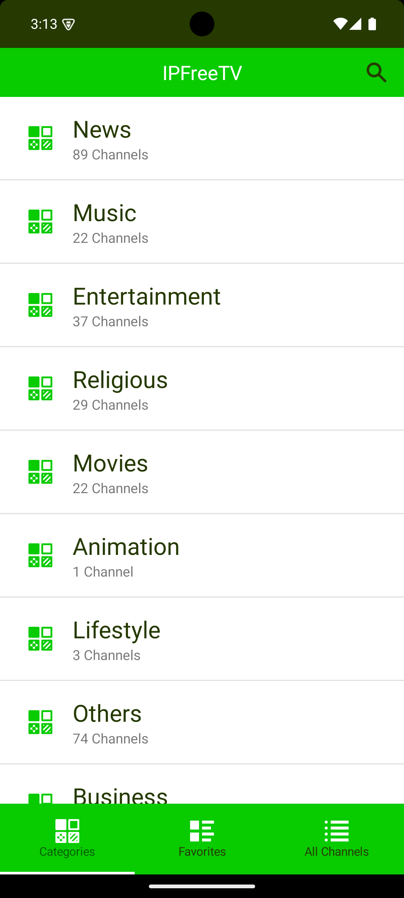
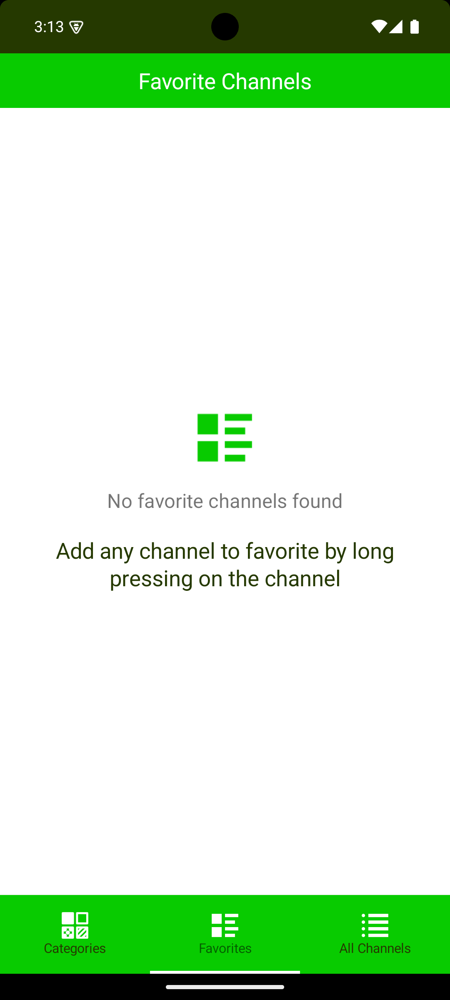
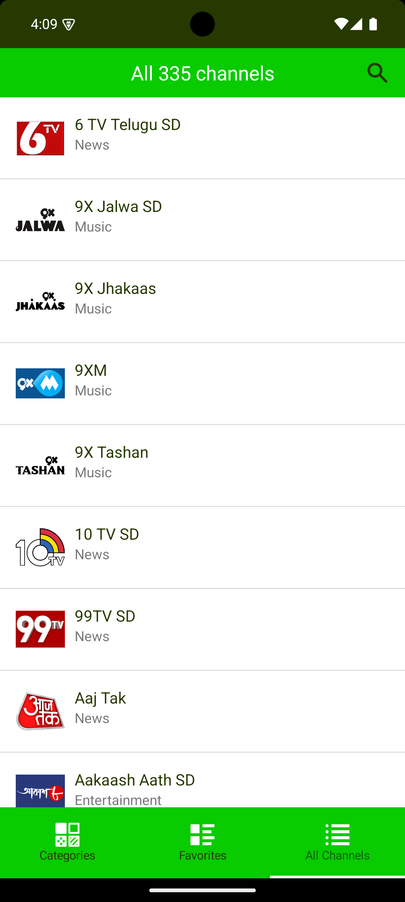

# IPFreeTV

IP TV app built using NativeScript for Android (working) and iOS (not tested).

## Features

- Stream IPTV channels with a simple, clean interface
- Built with NativeScript for cross-platform native performance
- Utilizes modern libraries and UI components for an optimized experience

## Screenshots
| Categories | Favorites | All Channels | Landscape | Portrait |
| :----: | :----: | :----: | :----: | :----: |
|  |  |  |  |  |


## Technologies Used

- NativeScript Core (`@nativescript/core`)
- NativeScript ExoPlayer (`@nstudio/nativescript-exoplayer`)
- NativeScript Community UI Material Ripple (`@nativescript-community/ui-material-ripple`)
- NativeScript Community UI Image (`@nativescript-community/ui-image`)
- TailwindCSS for styling

## Installation

1. Clone the repository:

```sh
git clone https://github.com/AbhijitDeyDev/ipfreetv.git
cd ipfreetv
```

2. Install dependencies:

```sh
npm install

or

pnpm install
```

3. Run for Android:

```sh
ns run android
```

3. Run for iOS (iOS platform is not tested currently):

```sh
ns run iOS
```

## Usage

- Launch the app on an Android device or emulator.
- Access and stream available IPTV channels in the UI.

## Related Projects

This app leverages publicly available IPTV playlists. For a large collection of IPTV channels worldwide, check out the [iptv-org/iptv](https://github.com/iptv-org/iptv) repository on GitHub.

## License

This project is licensed under the MIT License - see the [LICENSE](LICENSE) file for details.

## Author

Developer Name

## Acknowledgments

Thanks to the maintainers of the open source packages used in this project. Your work enabled this app:

- [@nstudio/nativescript-exoplayer](https://github.com/NativeScript/nativescript-exoplayer)
- [@nativescript/core](https://www.nativescript.org/)
- [@nativescript-community/ui-material-ripple](https://github.com/nativescript-community/ui-material-ripple)
- [@nativescript-community/ui-image](https://github.com/nativescript-community/ui-image)
- [TailwindCSS](https://tailwindcss.com/)

---

For issues, feature requests or contributions, please open a GitHub issue or pull request.

